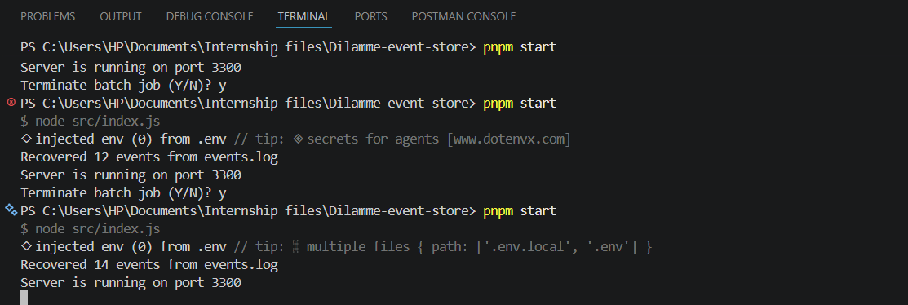
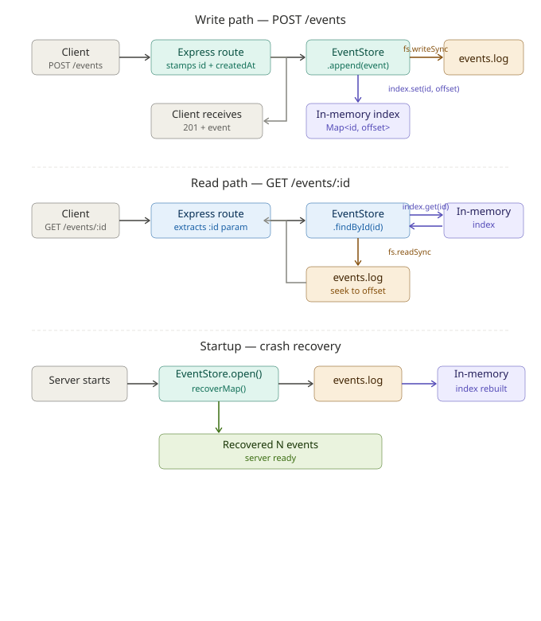

# Append-Only Event Store

A lightweight key-value store built on top of an append-only log file with an in-memory index. Built for speed and crash resilience — no SQLite, no ORM, just raw file I/O and a Map.

---

## Setup

### 1. Clone the repo

```bash
git clone https://github.com/nsien-prestige/event-store.git
cd event-store
```

### 2. Install dependencies

```bash
pnpm install
```

### 3. Run in development

```bash
pnpm dev
# No events.log found, starting afresh
# Server is running on port 3300
```

### 4. Run in production

```bash
pnpm start
```

### 5. Run tests

```bash
pnpm test               # all tests
pnpm test:unit          # unit tests only
pnpm test:e2e           # e2e tests only
```

---

## API Endpoints

### POST /events

Creates a new event. Accepts any valid JSON body. Stamps the event with a UUID and timestamp before appending to the log.

```bash
curl -X POST http://localhost:3300/events \
  -H "Content-Type: application/json" \
  -d '{"name": "Alice", "action": "purchase", "amount": 5000}'
```

**Response (201 Created):**

```json
{
  "name": "Alice",
  "action": "purchase",
  "amount": 5000,
  "id": "4b9e1a2c-3d4e-5f6a-7b8c-9d0e1f2a3b4c",
  "createdAt": "2026-05-30T14:22:01.000Z"
}
```

---

### GET /events/:id

Retrieves a single event by ID. Uses the in-memory index to seek directly to the right byte range in the log file — no file scanning.

```bash
curl http://localhost:3300/events/4b9e1a2c-3d4e-5f6a-7b8c-9d0e1f2a3b4c
```

**Response (200 OK):**

```json
{
  "name": "Alice",
  "action": "purchase",
  "amount": 5000,
  "id": "4b9e1a2c-3d4e-5f6a-7b8c-9d0e1f2a3b4c",
  "createdAt": "2026-05-30T14:22:01.000Z"
}
```

**Response (404 Not Found):**

```json
{
  "message": "Event not found"
}
```

---

### GET /events/stats

Returns the total number of events and the total size of the log file in bytes.

```bash
curl http://localhost:3300/events/stats
```

**Response (200 OK):**

```json
{
  "total": 3,
  "bytes": 412
}
```

---

## Restart & Crash Recovery Test

This is the most important feature of the event store. Here is how to verify it works:

1. Start the server and POST a few events, saving their IDs
2. Stop the server with `Ctrl+C`
3. Restart the server with `pnpm dev`
4. The server replays `events.log` on startup and rebuilds the index automatically
5. GET any previously saved ID — it still works



---

## Architecture

The diagram below shows how a `POST /events` write and a `GET /events/:id` read flow through the in-memory index and the log file.



### Write flow (POST /events)

1. Service gets the current file size — this becomes the `offset`
2. Event is stamped with UUID and timestamp, serialized to a JSON line
3. Line is appended to `events.log` using `appendFileSync`
4. `Map.set(id, { offset, length })` updates the in-memory index
5. Event is returned to the client with a 201 status

### Read flow (GET /events/:id)

1. Service looks up the ID in the Map — returns `{ offset, length }`
2. File is opened with `fs.openSync`
3. A buffer of exactly `length` bytes is allocated
4. `fs.readSync` seeks directly to `offset` and reads exactly `length` bytes
5. Buffer is parsed and returned — the rest of the file is never touched

---

## Core Concepts

### Why append-only is safer than overwriting

When you overwrite a file, you read it, modify it in memory, then write the whole thing back. If the process crashes in the middle of that write, the file is left in a corrupted state — partial data, broken JSON, or an empty file. You lose everything that was there before.

With an append-only approach, you never touch existing data. Every write adds a new line to the end of the file. If the process crashes mid-write, only that one line is potentially corrupted. Everything before it is completely intact. On restart, you just skip the bad line and recover everything else.

This is exactly how production databases like PostgreSQL work — they write to a Write-Ahead Log (WAL) before modifying any data. The log is the source of truth.

### Why an index makes reads fast

Without an index, finding an event by ID means reading the entire file from the beginning, parsing every line, and checking each one until you find a match. With a million events, that is a million line reads for every single request. Performance degrades linearly as the file grows.

With an in-memory index, every lookup is O(1). The Map stores the exact byte position (`offset`) and size (`length`) of every event. To read an event, the server jumps directly to that position in the file and reads exactly the right number of bytes. It does not matter whether there are 10 events or 10 million — every read takes the same amount of time.

---

## Project Reflections

### What I struggled with

**Append-only discipline** — My first instinct was to read the whole file, parse it into an array, push the new event, and write the whole thing back. That completely defeats the purpose of append-only. The fix was simpler than I expected: `fs.appendFileSync` adds to the end of the file without touching anything else. The hard part was changing how I thought about it, not the code itself.

**Understanding fs modules** — Working with raw file system operations was new territory. Functions like `fs.openSync`, `fs.readSync`, and `fs.closeSync` are not something you encounter in typical web development. I had to understand what a file descriptor is, what a buffer is, and why you have to explicitly close a file after reading it.

**`Buffer.byteLength` vs string length** — I initially used `eventData.length` to calculate the length of an event in the index. This breaks for unicode characters. A string like `"🚀"` has a JavaScript length of 2 but takes 4 bytes on disk. Using `string.length` as the byte length causes the index to point to the wrong position in the file. Switching to `Buffer.byteLength(eventData, 'utf-8')` fixed this — it returns the actual number of bytes the string takes on disk.

**`__dirname` in ES modules** — Coming from CommonJS, I expected `__dirname` to just work. It does not exist in ES modules. I had to use `fileURLToPath(import.meta.url)` combined with `path.dirname` to reconstruct it, then later switched to `process.cwd()` which was simpler for this use case.

**Module-level state in tests** — The in-memory `index` Map is declared at the module level in the service. This means it persists between tests when Node.js caches the module. Tests were seeing events from previous test runs and failing with wrong counts. I fixed this without touching the service by using `vi.resetModules()` in `beforeEach` and dynamically reimporting the service, which forces a fresh module instance with an empty Map for every test.

---

### What I learned

**How databases actually work under the hood** — Before this project, databases felt like magic boxes. Now I understand the core pattern: write to a log first, maintain an index for fast reads, and replay the log on startup to recover state. That is essentially what every serious database does.

**File descriptors and direct byte seeking** — I learned how to open a file, seek to a specific byte offset, read exactly N bytes, and close the file. This is a level of control I had never used before in Node.js.

**Buffer and byte-level operations** — Working with `Buffer.alloc`, `Buffer.byteLength`, and `buffer.toString('utf-8')` taught me that strings and bytes are not the same thing. JavaScript strings are unicode — their length in characters is not always their length in bytes.

**Crash recovery patterns** — The `recoverMap` function taught me how to design for failure. The server assumes it might crash at any time, so it never holds state that cannot be rebuilt from the log file. This is a real production pattern called crash recovery.

**ES module quirks in Node.js** — Working without CommonJS `require` and `__dirname` forced me to understand how ES modules actually resolve paths and exports.

---

### Resources consulted

**Documentation**
- [Node.js fs module](https://nodejs.org/api/fs.html) — for `fs.openSync`, `fs.readSync`, `fs.appendFileSync`, `fs.statSync`
- [Node.js Buffer](https://nodejs.org/api/buffer.html#static-method-bufferbytelengthstring-encoding) — for `Buffer.byteLength` and unicode handling
- [uuid npm package](https://www.npmjs.com/package/uuid) — for UUID v4 generation
- [Vitest documentation](https://vitest.dev/) — for `vi.resetModules()` and dynamic imports in tests

**AI Tools**
- [Claude (Anthropic)](https://claude.ai) — for guidance on architecture and debugging

---

### Why this made me a better backend developer

Before this project, I thought about storage only in terms of databases — you pick Postgres or MongoDB, connect an ORM, and you are done. I never thought about what happens inside those databases or why they make certain design choices.

Now I understand why append-only logging exists. I understand why indexes exist. I understand what a file descriptor is and how byte-level seeking works. When I use a database in the future, I will think about the WAL underneath it, the indexes it maintains in memory, and how it recovers after a crash.

More practically, I can now think about resilience from the start. The question "what happens if this process crashes right here?" is now part of how I design systems. That is a production mindset that most developers only develop after seeing things break in the real world. This project gave me that experience in a controlled setting.